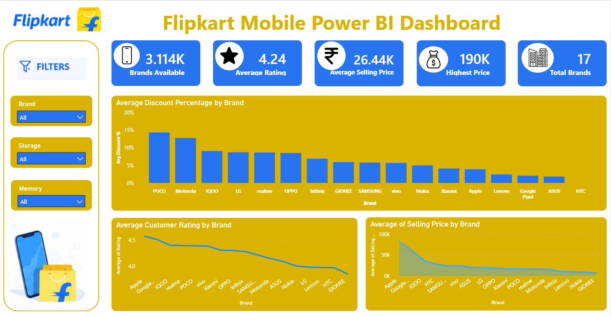
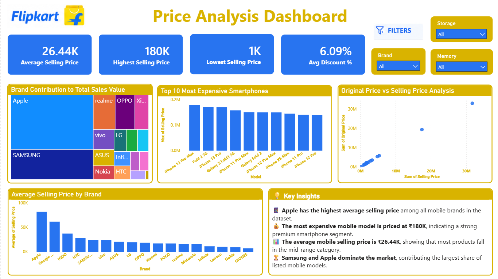

# 📱 Flipkart Mobile Power BI Dashboard

## Project Overview

This project was developed during the **Horizon Internship Program** to analyze 3,114 Flipkart mobile phone listings and uncover insights related to pricing trends, customer ratings, discount strategies, and brand positioning.

The dashboard was built using **Power BI** to transform raw mobile listing data into meaningful business insights through interactive visualizations, KPIs, filters, and analytical reports. The objective was to understand the smartphone market landscape and identify patterns in pricing, discounts, customer satisfaction, and premium brand positioning.

---

## Business Questions Addressed

* Which brands offer the highest average discounts?
* Which brands maintain the highest customer ratings?
* Which brands operate in the premium smartphone segment?
* How do original prices compare with selling prices?
* Which brands contribute the most to overall sales value?
* What pricing patterns exist across different smartphone brands?

---

## Tools & Technologies Used

* Power BI
* DAX (Data Analysis Expressions)
* CSV Dataset
* Git & GitHub
* Visual Studio Code

---

## Dashboard Preview

### 📊 Page 1 – Market Overview

**Key Components:**

* Total Mobile Listings
* Average Customer Rating
* Average Selling Price
* Highest Selling Price
* Brands Available
* Average Discount Percentage by Brand
* Average Customer Rating by Brand
* Average Selling Price by Brand

---

### 💰 Page 2 – Price Analysis

**Key Components:**

* Brand Share of Total Sales Value
* Top 10 Most Expensive Smartphones
* Original Price vs Selling Price Analysis
* Interactive Brand Filters
* Business Insights Summary

---

## Key Insights

### 📱 Market Overview

* The dataset contains **3,114 mobile phone listings** across **17 smartphone brands**.
* The average smartphone rating is **4.24**, indicating generally positive customer satisfaction.
* The average selling price is **₹26.44K**, showing a strong presence of mid-range smartphones in the market.
* The highest listed smartphone price reaches **₹190K**, highlighting the premium smartphone segment.

### 💸 Discount Analysis

* **POCO** and **Motorola** offer the highest average discounts among major brands.
* Discount percentages vary significantly across brands, reflecting different pricing and promotional strategies.

### ⭐ Customer Ratings

* Premium brands such as **Apple** and **Google Pixel** maintain consistently high customer ratings.
* Higher-priced smartphones generally receive strong customer feedback, suggesting a correlation between premium products and user satisfaction.

### 💎 Brand Positioning

* **Apple** dominates the premium smartphone category with the highest average selling prices.
* Most brands are concentrated in the budget and mid-range market segments.

### 📈 Price Analysis

* A strong positive relationship exists between Original Price and Selling Price.
* Apple contributes the largest share of total sales value despite having fewer product listings than some competitors.
* The premium smartphone segment is largely dominated by Apple and Samsung flagship devices.

---

## Skills Demonstrated

* Data Cleaning & Transformation
* KPI Development
* DAX Calculations
* Dashboard Design
* Business Intelligence Reporting
* Data Visualization
* Analytical Thinking
* Insight Generation
* Interactive Dashboard Development

---

## Repository Structure

Flipkart-Mobile-PowerBi

├── Dashboard
│   └── Flipkart_Mobile_Dashboard.pbix

├── Dataset
│   └── Flipkart_Mobiles.csv

├── Images
│   ├── page1.png
│   └── page2.png

└── README.md

---

## Conclusion

This project demonstrates how Power BI can be used to transform raw e-commerce data into actionable business insights. Through interactive dashboards and analytical visualizations, the project highlights smartphone pricing trends, customer preferences, discount strategies, and brand positioning within the Flipkart mobile marketplace.

Developed as part of the **Horizon Internship Program** to strengthen practical skills in Data Analytics, Business Intelligence, and Dashboard Development.
